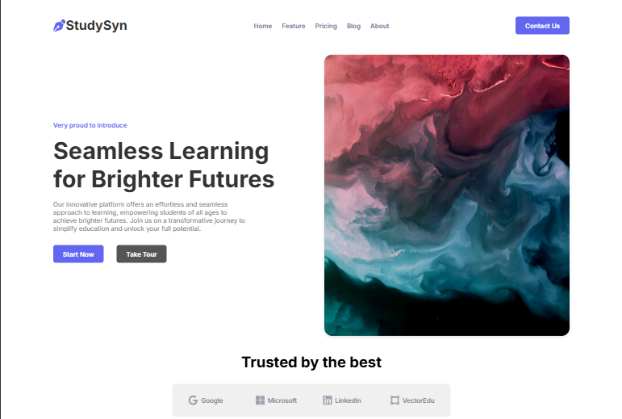
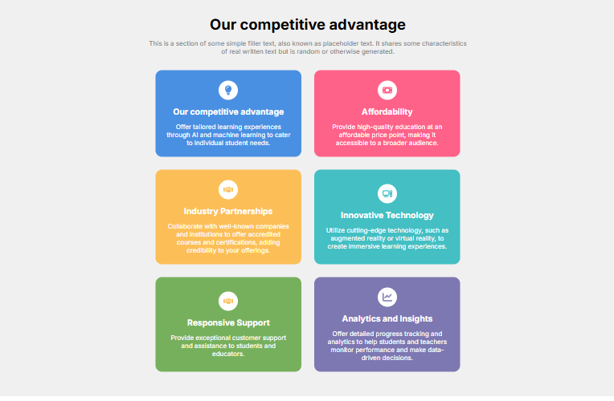
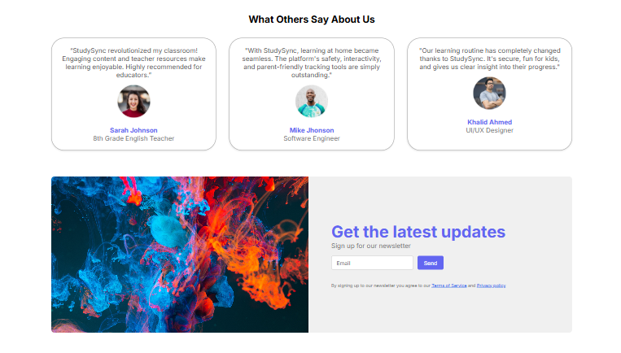
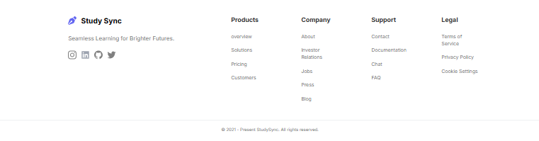
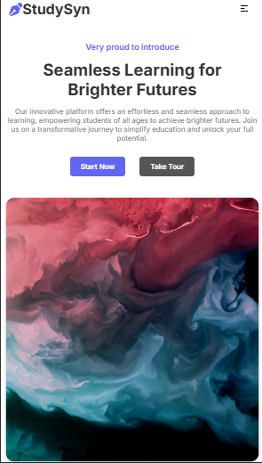
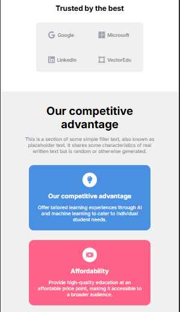
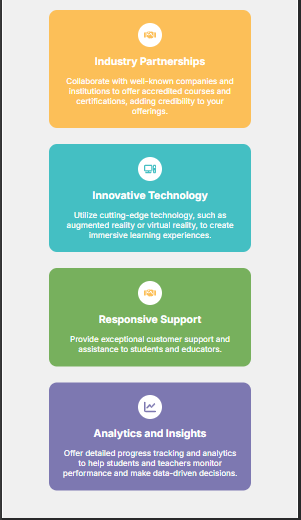
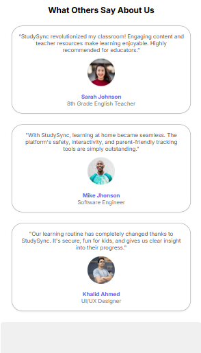
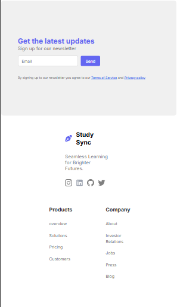

# 📚 StudySync - Responsive Education Website

**StudySync** is a fully responsive educational website built using **HTML** and **CSS only**, designed to showcase a clean and modern layout for online learning platforms. It adapts seamlessly to all screen sizes—from mobile devices to large desktops.

---

## 🚀 Features

- 🎯 Responsive layout for all devices (mobile, tablet, desktop)
- 🧭 Clean navigation bar with smooth transitions
- 📖 Hero section with call-to-action
- 🗂️ Course highlights or feature sections
- 📦 Fully built using pure HTML and CSS (no JavaScript)
- 💡 Well-structured, readable, and reusable code

---

## 🛠️ Tech Stack

| Technology | Description                  |
|------------|------------------------------|
| HTML5      | Page structure & content     |
| CSS3       | Styling & responsiveness     |
| Media Queries | For making layout adaptive |

---

## 📸 Screenshots

### 💻 Desktop View










### 📱 Mobile View











---

## 📦 Installation & Usage

### 1. Clone the Repository

```bash
git clone https://github.com/your-username/studysync.git
cd studysync
```

### 2. Open the Project


Open the index.html file in your browser using:

Double-click index.html
OR

Use Live Server in VS Code


### 🧠 What I Learned


Building responsive layouts using Flexbox and Grid

Designing clean and modern UI with pure CSS

Implementing mobile-first design with media queries

Organizing HTML/CSS files for scalability


### 🤝 Contributing

Contributions are welcome! Feel free to fork the repository and submit pull requests.